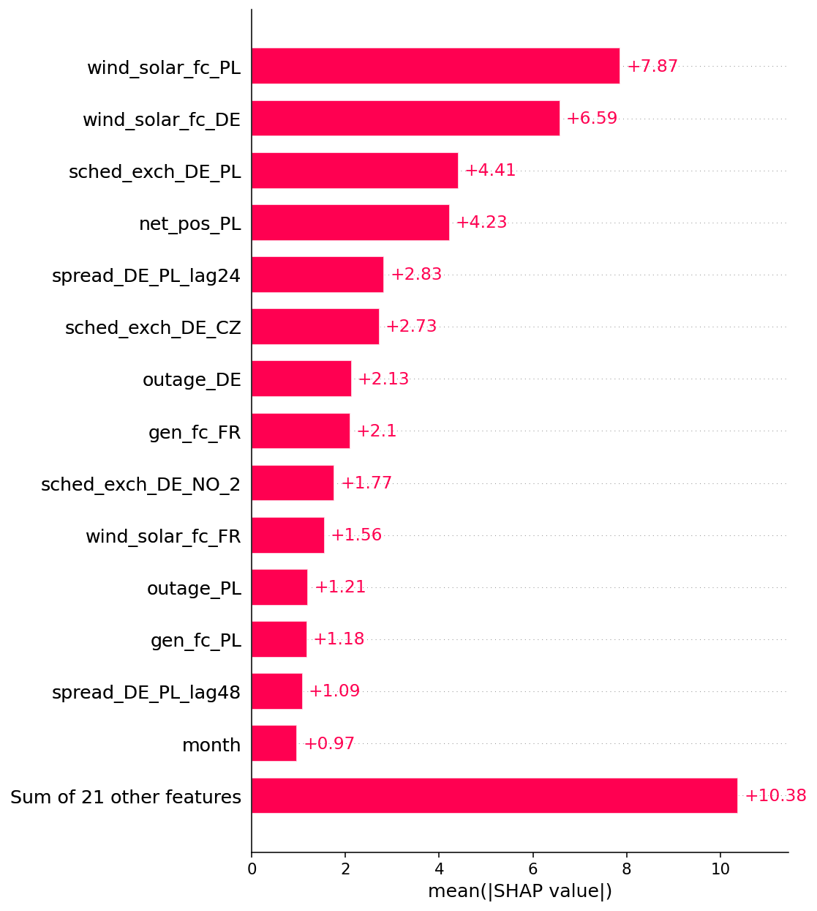
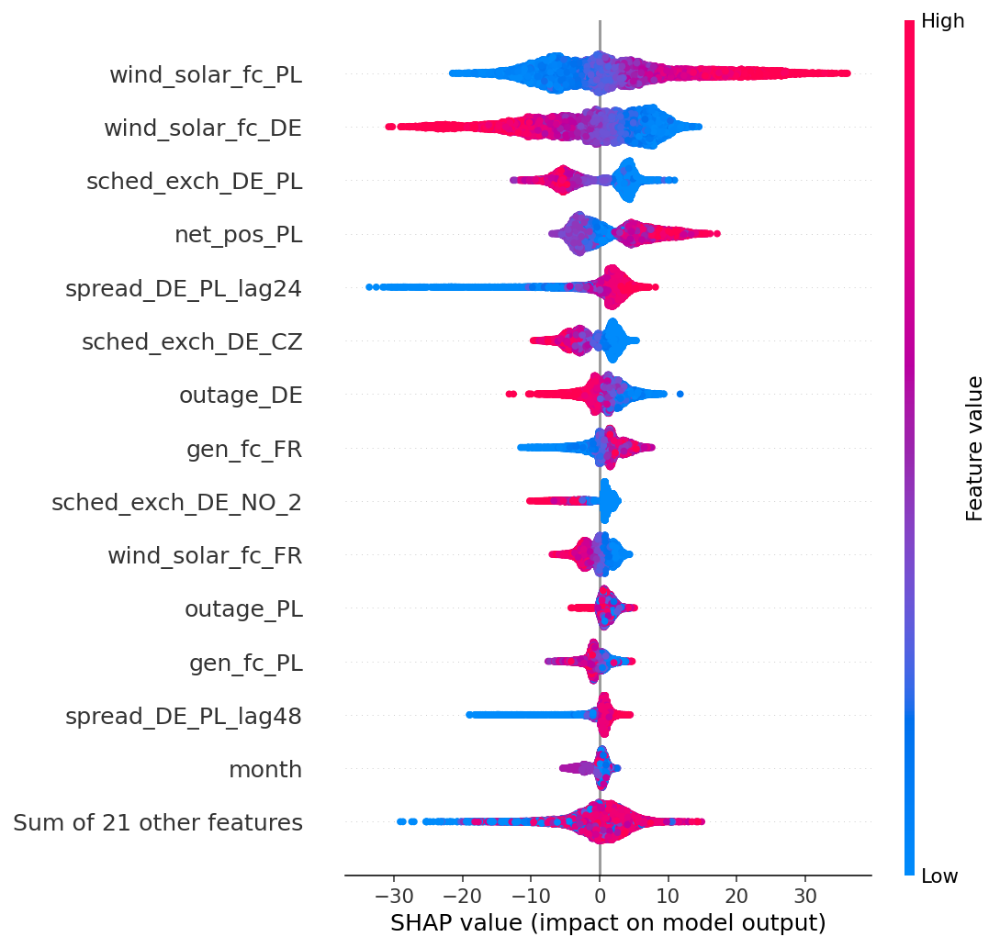
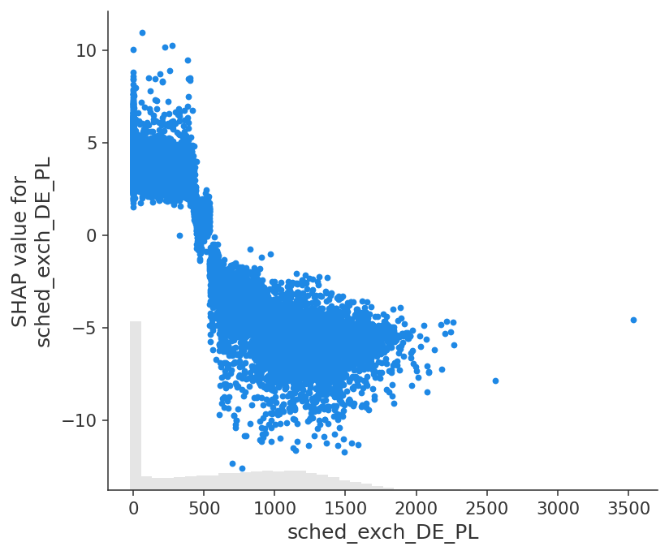
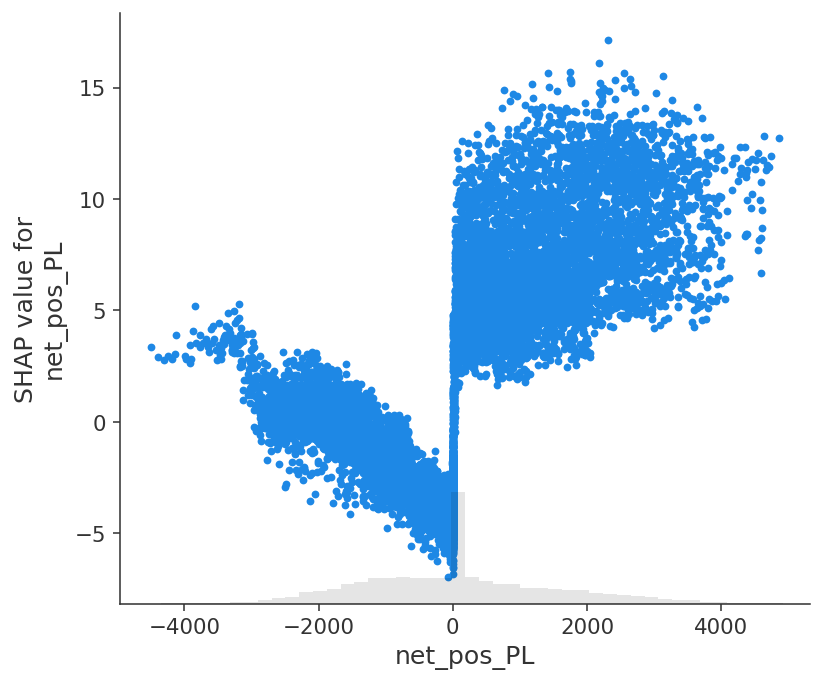
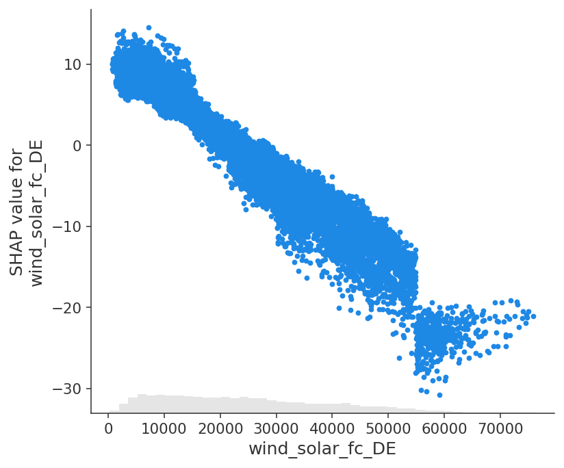

# Forecasting Inter-Zonal Electricity Price Spreads in European Markets: An Applied Study with Explainable Machine Learning

## 1. Introduction

Electricity does not store cheaply, so its price is set anew each hour by the physical balance of supply and demand within a bidding zone. Where two zones are joined by a limited interconnector, their prices are held together only as long as that link is uncongested; when it saturates, the prices decouple and a *spread* opens between them. These inter-zonal spreads are the object traded in cross-border markets and the risk borne by anyone with exposure on both sides of a border, and they are economically distinct from the price *levels* that dominate the forecasting literature: a spread cancels the large common drivers — fuel, carbon, aggregate weather — and is left with the comparatively rare, regime-dependent events of congestion.

This study asks a single, narrow, applied question about that object. Given the choice between modelling a spread **directly** and the obvious alternative of **differencing two independently forecast zonal prices**, does the direct approach forecast better? Both predict the same quantity; the question is purely which is the better route to it, and it is motivated by the regime-switching economics of the spread — the possibility that a spread-targeted model can represent the coupling/decoupling structure that two separate level forecasts cannot. The question is posed out-of-sample, with strictly leakage-consistent features, for two contrasting German borders: the well-coupled German–French spread and the more congestion-prone German–Polish one.

The answer is asymmetric, and that asymmetry is the finding. On the well-coupled DE-FR border nothing wins: direct and differenced, linear and nonlinear all land near €19/MWh mean absolute error and no difference is statistically significant. On the congestion-prone DE-PL border, by contrast, modelling the spread directly with a tuned gradient-boosted model is significantly best (14.40 €/MWh MAE, beating both the differenced-forecast benchmark and the linear model at p < 0.001 under a conservative Diebold–Mariano test). A SHAP interpretation then shows *why*: the DE-PL advantage traces to sharp, threshold-shaped effects — regime switches at the point where Poland flips from net importer to exporter, and where German renewables tip the German price below zero — that a linear model cannot represent and that exist precisely where, and only where, the coupling/decoupling theory predicts them. The contribution is deliberately framed as a rigorous applied study with an honest benchmark and an interpretation layer, not a claim of methodological novelty.

The resulting model is not left as a notebook artefact. It runs as a live system: a scheduled daily pipeline refetches the latest market data, retrains, and republishes forecasts to a public dashboard, described in Section 8. The remainder of the paper proceeds from the literature (Section 2) and data (Section 3) through the methodology (Section 4), the linear-benchmark and gradient-boosting results (Sections 5 and 6), the SHAP interpretation (Section 7), the deployed system (Section 8), and a concluding discussion (Section 9).

## 2. Literature Review

Electricity price forecasting (EPF) is a mature field whose standard task is the day-ahead prediction of a *single bidding zone's* price level, and whose methods have moved from linear and regime-switching time-series models to machine and deep learning. A persistent lesson, consolidated by Lago et al. (2021), is that well-specified linear benchmarks such as their LEAR model are hard to beat and that gains from complex models are often fragile — a caution that motivates demanding benchmarks.

This lesson extends to deep learning specifically. Recurrent, convolutional, and transformer architectures frequently fail to convincingly outperform LEAR or gradient-boosted trees on day-ahead prices, and the improvements that are reported tend to be fragile to evaluation choices (Lago et al., 2021). The reason is structural rather than incidental: day-ahead forecasting is a *tabular* problem of *medium* size — a few years of hourly observations, here on the order of tens of thousands of rows — and on tabular data of this scale gradient-boosted trees and regularised linear models are consistently competitive with, or superior to, deep networks, whose representational advantages emerge only with far larger samples or unstructured inputs (Grinsztajn et al., 2022). The signal is compounded for an inter-zonal *spread*, where the informative events — divergences under congestion — are comparatively rare, so the effective sample of the phenomenon of interest is smaller still. This study therefore restricts itself to a regularised-linear benchmark and gradient boosting and does not pursue deep learning: for a dataset of this size and structure, doing so is a principled choice rather than a limitation.

This review positions a deliberately narrow, applied study: taking the *inter-zonal price spread* as the forecasting target, testing whether modelling it directly improves on the obvious alternative of differencing two zonal forecasts, and interpreting the result with SHAP. It does not claim a major unoccupied gap; rather, it locates a specific applied question that the existing strands leave untested.

### 2.1 Explainability in European price modelling — and why SHAP is not the novelty here

As black-box models came to dominate EPF, SHapley Additive exPlanations (SHAP) became the standard interpretability tool, attributing a prediction to its inputs by fairly distributing the deviation from a baseline. A clear body of work now applies it to single-zone price levels — for example Trebbien et al. (2023), who use SHAP to interrogate German price formation "beyond the merit order principle," with subsequent applications to other European markets. The most relevant study is Pesenti and O'Sullivan (2026), who apply SHAP across thirty-nine bidding zones and explicitly quantify cross-border interdependencies, finding that neighbouring-zone features account for roughly 61% of price importance on average.

It is important to be honest about what this implies for the present work. Because Shapley values are additive in the target, attributing two zones' price *levels* is closely related to attributing their *difference*: in principle, explaining price_A and price_B contains the information to explain price_A − price_B. Applying SHAP to the spread is therefore **not, in itself, a conceptual departure** from the level-based literature, and this study does not claim it as one. What Pesenti and O'Sullivan (2026) do *not* do is forecast: by the authors' statement their model "is clearly not a forecasting model" — it uses contemporaneous fundamentals and has no out-of-sample, leakage-consistent target. The role of SHAP in the present work is accordingly an **interpretation layer over a forecasting model**, not a novel method; its value is contingent on that model first demonstrating genuine predictive skill.

### 2.2 The spread mechanism and its status as a forecasting target

The economics of inter-zonal spreads are well understood. Under European price coupling, connected zones' prices equalise when interconnector capacity suffices and diverge only under congestion, so the spread is a *regime-dependent, censored* quantity — near zero when coupled, non-zero under congestion. Alasseur and Féron (2018) formalise this with a structural model of two coupled markets and a closed-form decoupling probability. This structure is the one substantive reason to expect that modelling the spread *directly* might beat differencing two zonal level forecasts: level forecasts spend their capacity on the large common drivers (fuel, carbon, aggregate demand) that cancel in the spread, whereas a spread-targeted model can, in principle, represent the coupling/decoupling regime itself. Whether it does so *in practice* is an empirical question, not a logical guarantee.

On the modelling side, the closest work is explanatory rather than predictive. Saez et al. (2019) apply random forests to characterise price *equalisation* across Central Western Europe, but do not treat the spread as a continuous forecast target or use SHAP. Direct treatments of the spread *as a forecasting target* are rare and predate the modern toolkit: Ferkingstad and Løland (2014) forecast Nordic Contracts for Difference — an area-minus-system spread — with statistical methods, and Imani (2024) predicts only the *sign* of the Italian inter-zonal price difference. No identified study sets a European inter-zonal spread as an out-of-sample machine-learning target and interprets it with SHAP — but, per Section 2.1, the intellectual distance from existing work is modest, and the contribution is best understood as applied rather than methodological.

### 2.3 Positioning of the present work

The literature leaves a specific, narrow question untested: for a major European inter-zonal spread, does modelling it **directly** forecast it better than **differencing two independent zonal forecasts** — the benchmark implied by Lago et al. (2021)? Both approaches predict the same quantity; the question is purely which method is better, motivated by the regime-switching structure of the spread (Alasseur and Féron, 2018). This study answers that question out-of-sample with leakage-consistent features, and then uses SHAP to interpret the drivers of whatever structure the winning model exploits. The framing is deliberately modest: the contribution is a rigorous applied forecasting study with an honest benchmark and interpretation layer, not a claim of methodological novelty. Should the direct model fail to beat the differenced-forecast benchmark, that is itself an informative result — evidence that, for these zones, the spread carries no exploitable structure beyond the zonal levels.

> *Note on scope.* No directly comparable study was identified in a structured search of major bibliographic and preprint sources; given the practitioner-dominated nature of spread trading and the possibility of paywalled, conference, or non-English work, this is stated as "not identified" rather than proven absent. More importantly, the value of the study rests on execution and honest benchmarking, not on a novelty claim.

## 3. Data

Day-ahead market data for three bidding zones — Germany–Luxembourg (DE-LU), France (FR) and Poland (PL) — were obtained from the ENTSO-E Transparency Platform through its REST API using the `entsoe-py` client. For each zone the pull comprised the day-ahead price, actual load and the day-ahead load forecast, actual generation by production type, the day-ahead wind-and-solar forecast, the day-ahead aggregated generation forecast, installed capacity, and generation-unit outages. Cross-border series comprised the physical flows on all German borders, the day-ahead scheduled commercial exchanges, and the French and Polish net positions. The two forecast targets are the inter-zonal spreads defined as spread_DE_FR = price_DE − price_FR and spread_DE_PL = price_DE − price_PL.

Assembling these series into a single analysable table required resolving several real-world data-quality issues, each of which materially affects the spread. First, the DE-LU bidding zone came into existence only with the October 2018 split of the former DE-AT-LU zone, so German data — and therefore both spreads — begin in late 2018, and the analysis is restricted accordingly. Second, ENTSO-E reported Polish day-ahead prices in złoty (PLN) before 20 November 2019 and in euros thereafter; left uncorrected this inflated the DE-PL spread roughly four-fold across the affected period, and the PLN interval was converted to euros using monthly-average European Central Bank EUR/PLN reference rates. Third, on 1 October 2025 several European day-ahead markets moved to a 15-minute settlement interval, so prices arrive quarter-hourly while other series remain hourly; all series were resampled to a common hourly grid. Finally, mixed daylight-saving offsets, MultiIndex and stringified-tuple generation headers, and event-shaped outage records were normalised during parsing, with outages expanded from event records into an hourly "capacity unavailable" series. The result is a single hourly modelling table of approximately 66,000 rows and 51 columns spanning December 2018 to July 2026.

## 4. Methodology

The day-ahead auction clears once per day for all twenty-four hours of the following day, so the forecasting task is to predict, at gate closure, the next day's hourly spreads (a 12-to-36-hour horizon). A single pooled model is used, with one row per delivery hour and hour-of-day, day-of-week and month one-hot encoded, so that one model captures time-of-day structure through those indicators rather than requiring a separate model per hour.

Only information available at gate closure is used as a feature: the day-ahead forecasts of load, wind-and-solar and total generation for all three zones; the day-ahead scheduled cross-border exchanges and net positions; generation outages; and calendar and national-holiday indicators. Realised prices, realised ("actual") fundamentals and physical flows are excluded as leakage, since they would not be known when the forecast is made. In a second iteration, lagged values of the target at 24, 48 and 168 hours are added; all lags are at least twenty-four hours old, respecting the day-ahead constraint that the most recent known value is from the previous day.

The benchmark model is LASSO — a LEAR-style regularised linear regression — with the penalty strength selected automatically by cross-validation on each training window. Forecasts are evaluated by mean absolute error (MAE) and root-mean-square error (RMSE), reported both overall and separately for coupled (|spread| < €1/MWh) and diverged hours, against naive baselines (predict-zero, predict-mean and persistence), with a stylised Sharpe-ratio backtest as a supplementary economic measure. An initial static chronological split (train ≤ 2023, validate 2024, test 2025 to mid-2026) was subsequently replaced by walk-forward evaluation with a rolling two-year window retrained monthly — development over 2021–2024 and a final, untouched test period of 2025 to mid-2026 — after the static split proved to interact badly with the regime shift described below.

### 4.1 Nonlinear model, tuning and significance testing

The nonlinear counterpart to the LASSO benchmark is gradient-boosted regression trees (XGBoost), selected over deep learning for the reasons set out in Section 2. It uses the identical leakage-safe feature set and the same 24/48/168-hour target lags; trees require neither feature scaling nor one-hot encoding, so the calendar variables are supplied to XGBoost as native categorical features and the numeric features unscaled. Model and evaluation protocol are otherwise held identical to the LASSO run — the same rolling two-year walk-forward, the same targets, the same test rows — so that every comparison isolates the effect of the model alone. Within each monthly refit the final eight weeks of the training window are held out as an early-stopping set, and the number of trees is chosen by early stopping rather than fixed.

Hyperparameters were selected in two deliberate stages. The first was a manual sweep on a fixed development split (train 2021–2023, validate 2024), varying tree depth and the minimum-child-weight regulariser one at a time to build intuition and locate the operative region of the space. The second was a systematic search with Optuna, a Bayesian (Tree-structured Parzen Estimator) optimiser, over the full joint space — learning rate, depth, minimum child weight, row and column subsampling, and the L1/L2/split-gain penalties — minimising cross-validated MAE. Crucially, the cross-validation for tuning was **not** an expanding-window split, which would have concentrated its validation weight on the extreme 2022 energy-crisis period and tuned the model to a regime irrelevant to deployment; instead three rolling folds, each training on a two-year window and validating the following six months across recent post-crisis periods (2023 H2, 2024 H1, 2024 H2), were used, mirroring the deployment protocol and keeping validation in the relevant regime. The search was tracked with MLflow, logging each trial's parameters and fold scores. The single tuned configuration was then frozen and run once through the walk-forward on the untouched 2025+ test set; the test set was used exactly once, with no re-tuning thereafter.

Statistical significance of forecast-accuracy differences was assessed with the Diebold–Mariano (1995) test on the absolute-error loss differential, using a Newey–West (Bartlett-kernel) HAC variance because the once-daily forecast errors are autocorrelated for several days, and reporting the statistic across a bandwidth sweep so that any dependence of the verdict on the bandwidth is transparent. The test was applied both to the direct-versus-differenced comparison within each model and to the XGBoost-versus-LASSO comparison for the directly-modelled spread.

## 5. Results: Linear Benchmark (LASSO)

A pronounced regime shift dominates the period. The DE-FR spread was near zero or negative through 2018–2023, with Germany usually the cheaper zone (7–28% of hours positive), but flipped to consistently positive in 2024–2026 (median +18 to +21 €/MWh; around 70% of hours positive) as French nuclear output recovered while German prices remained gas-linked. The level of the renewable-forecast features also drifted upward over the period as installed capacity grew.

Static training failed under this shift. A LASSO trained on 2018–2023 systematically under-predicted the new regime and was beaten by naive baselines on the 2025+ test set: a DE-FR MAE of 27.9 €/MWh against a persistence baseline of 24.4, and a DE-PL MAE of 39.3 — worse than simply predicting zero (18.7). Walk-forward retraining resolved this. Refitting monthly on a rolling two-year window, so that recent data always inform the forecast, restored competitive performance, and both models then beat every naive baseline:

| Approach (test MAE, €/MWh) | DE-FR | DE-PL |
|---|---|---|
| persistence (t−24h) | 24.4 | 22.1 |
| static LASSO | 27.9 | 39.3 |
| walk-forward, no lags | 22.2 | 17.3 |
| walk-forward, with lags | 19.3 | 16.2 |

Retraining was the decisive intervention; lagged-spread features contributed a smaller further improvement.

The central question is whether modelling the spread directly outperforms forecasting the two zonal prices separately and differencing them. Using the same walk-forward LASSO with lags, evaluated on the identical 2025+ test rows:

| Spread | Direct MAE (€/MWh) | Differenced MAE (€/MWh) |
|---|---|---|
| DE-FR | 19.2 | 18.9 |
| DE-PL | 16.2 | 17.1 |

Both gaps are below €1/MWh against MAEs of roughly €16–19, so a Diebold–Mariano (DM) test was applied to establish whether either difference is statistically meaningful. Because the forecasts are issued once daily, their hourly errors are strongly autocorrelated — the loss differential remains correlated for several days, and the Newey–West (1994) automatic bandwidth is roughly 240 hours — so the DM statistic was computed with a Bartlett (Newey–West) HAC variance and examined across a bandwidth sweep, since a too-short bandwidth understates the variance and manufactures significance. The verdict is split and asymmetric:

- **DE-FR: no significant difference.** The direct model is nominally worse by €0.37/MWh, but this reaches significance only at an indefensibly short one-day bandwidth (p = 0.02); at three days and beyond it is insignificant (p = 0.08 rising to 0.22 at two weeks). For this tightly-coupled border the two approaches are genuinely equivalent, as anticipated in Section 2.3 — differencing two clean level forecasts loses nothing.
- **DE-PL: the direct model is significantly better, robustly so.** It beats differencing by €0.83/MWh, and the result survives every bandwidth tested, remaining significant at a conservative two-week HAC bandwidth (p = 0.002 at one week, 0.010 at two weeks).

The direct advantage therefore appears on the more congestion-prone DE-PL border and not on the well-coupled DE-FR one. A plausible — though here untested — reading is that the Polish price is the more idiosyncratic level to forecast in isolation, so differencing compounds two noisy level forecasts, whereas a spread-targeted model cancels the common drivers and represents the coupling/decoupling regime directly, exactly the mechanism of Alasseur and Féron (2018) that motivated the question. This is the more informative outcome: for at least one major European spread, modelling it directly does extract structure that differencing discards.

The Sharpe ratios obtained (approximately 15–24) are inflated by the persistently one-signed spread in the test period — direction is trivially predictable when the sign rarely changes — and should not be read as evidence of skill; MAE is the reliable metric. This linear-benchmark verdict establishes the direct-versus-differenced result; whether nonlinear gradient boosting widens the DE-PL advantage, or surfaces one on DE-FR, is the subject of Section 6.

## 6. Results: Nonlinear Model (Gradient Boosting)

**Hyperparameter tuning revealed an irreducible error floor rather than a capacity limit.** In the manual sweep, increasing tree depth from 2 to 8 on the 2024 validation set left validation MAE essentially flat at roughly €18/MWh while training MAE fell from 24 to 11 and the train–validation gap widened from near zero to +7.6 — the signature of a model memorising training noise without improving generalisation. Sweeping the minimum-child-weight regulariser told the same story: at the shallow depth that reaches the floor, the constraint is slack (leaves already hold hundreds of rows) and validation MAE does not move. The subsequent Optuna search confirmed the floor systematically: across sixty trials over the full joint space, cross-validated MAE stayed within a narrow band of roughly €17.0–18.0, with a best of €17.01. Tellingly, that best configuration is a *deep* tree (depth 7) held in check by heavy regularisation elsewhere — a large minimum child weight of 121, aggressive row subsampling and an L2 penalty — reaching the very same floor that a shallow, unregularised depth-4 tree reached in the manual sweep. That two structurally opposite configurations meet at the same error, and that all sixty trials span barely €1 of MAE, together imply the specific tuned configuration is close to arbitrary — many combinations are equivalent — and that no hyperparameter choice pushes the model below the floor. This is the Section 2 medium-tabular-data lesson confirmed on the present data.

Run once on the untouched 2025+ test set, the tuned XGBoost was compared head-to-head with the LASSO benchmark under the identical walk-forward, for both spreads and both forms:

| Spread | Model / form | MAE | RMSE | Sharpe |
|---|---|---|---|---|
| DE-FR | LASSO direct | 19.21 | 26.59 | 24.19 |
| | LASSO differenced | 18.85 | 26.30 | 24.08 |
| | XGBoost direct | 19.17 | 27.52 | 24.01 |
| | XGBoost differenced | 20.59 | 28.78 | 21.65 |
| DE-PL | LASSO direct | 16.24 | 25.59 | 15.52 |
| | LASSO differenced | 17.07 | 26.12 | 14.34 |
| | **XGBoost direct** | **14.40** | **25.43** | **15.75** |
| | XGBoost differenced | 16.63 | 25.99 | 15.32 |

Two Diebold–Mariano tests, each across the bandwidth sweep, formalise the comparison. First, **direct versus differenced within XGBoost**: on DE-PL the direct model beats differencing by €2.23/MWh, significant at every bandwidth (p = 0.000 out to two weeks); on DE-FR the direct model is also significant, but this reflects that differencing two volatile *nonlinear* price forecasts compounds their errors (XGBoost-differenced is the worst cell in the table) rather than any spread-specific structure — XGBoost-direct merely matches the same ~€19 floor as the linear models. Second, **XGBoost versus LASSO on the directly-modelled spread**: on DE-FR the two are statistically indistinguishable (p ≈ 0.9 at every bandwidth), whereas on DE-PL XGBoost beats LASSO by €1.84/MWh, significant at every bandwidth (p = 0.000 out to two weeks).

The two findings align and reinforce each other. Both improvements — modelling the spread directly rather than differencing, and using a nonlinear model rather than a linear one — appear **only on the congestion-prone DE-PL border and are entirely absent on the well-coupled DE-FR one**. This is the coherent result the study was constructed to test: the DE-PL spread carries real, exploitable structure that survives only when the spread is modelled directly *and* nonlinearity is permitted, precisely where the Alasseur–Féron coupling/decoupling mechanism predicts such structure should exist, and precisely absent where it should not. The best model of the DE-PL spread is therefore the directly-modelled, tuned XGBoost, at €14.4/MWh MAE — a statistically significant improvement over both the differenced-forecast benchmark and the linear model. As in Section 5, the Sharpe ratios are inflated by the one-signed test-period regime and are not read as evidence of skill.

Because this model demonstrates genuine, significance-tested predictive skill, it is the appropriate — and only appropriate — subject for the SHAP interpretation layer motivated in Section 2.1, presented in Section 7.

## 7. Interpretation: What the DE-PL Model Learned

SHAP was applied to the winning model — the directly-modelled, tuned XGBoost for the DE-PL spread — following the discipline of Section 2.1 that interpretation is warranted only once a model has demonstrated skill. A single explanatory model was trained on the most recent two-year window (2023–2024) and its predictions on the 2025+ test set attributed with `TreeExplainer`; this explanatory model reproduces the deployed model's accuracy (test MAE 13.5 €/MWh against the walk-forward's 14.4), so its attributions are representative. For robustness the calendar features were supplied as integers rather than native categoricals, a minor approximation that does not affect the ranking.

**The drivers fall into two economically distinct tiers.** The two largest by mean absolute SHAP are the zonal renewable forecasts — Polish wind-and-solar (7.9 €/MWh) and German wind-and-solar (6.6) — followed by a cluster of cross-border coupling variables: the DE-PL scheduled interconnector flow (4.4), the Polish net position (4.2), and the neighbouring DE-CZ scheduled flow (2.7). Persistence (the 24-hour lag, 2.8) and cross-zone spillovers from France (French generation and renewable forecasts, 2.1 and 1.6) are secondary, and calendar and time-of-day features are near-negligible — consistent with a spread that is fundamentals-driven rather than clock-driven. The directions confirm merit-order economics on the spread: high Polish renewables cheapen Poland and widen the DE−PL spread (positive SHAP), while high German renewables cheapen Germany and compress it (negative SHAP), signs that agree with the LASSO coefficients and so cross-validate the two models' economic content. It is worth noting that gain-based tree importance had ranked the 24-hour lag first; SHAP corrects this picture, showing that while the lag participates in many splits, the *magnitude* of the spread is carried by the renewable and cross-border fundamentals — a distinction only an attribution method surfaces.

*Figure 1. Global driver importance (mean |SHAP|, €/MWh). The two zonal renewable forecasts lead, followed by the cross-border coupling variables.*

*Figure 2. Beeswarm of per-hour contributions. Each dot is one delivery hour; horizontal position is the driver's push on the predicted spread, colour is the feature value (red high, blue low). High Polish renewables push the spread up; high German renewables push it down.*

**The interpretation also explains the model's edge over the linear benchmark.** Several drivers act on the spread through sharp *thresholds* rather than smooth slopes — structure a regularised linear model cannot represent but a tree can. The clearest is the Polish net position, whose dependence exhibits a discontinuity at zero: the moment Poland switches from net importer to net exporter its contribution jumps stepwise from around −5…+3 to +5…+15 €/MWh. The DE-PL scheduled-exchange dependence is a similar step — a positive plateau at low scheduled flows that drops sharply once the flow exceeds roughly 500 MW (Figure 3). Even a headline fundamental, the German renewable forecast, carries a threshold of its own (Section 7.1). These are not gradients but regime switches, and they are exactly the coupling/decoupling structure that Alasseur and Féron (2018) formalise: the spread behaves qualitatively differently depending on whether the interconnector is congested and in which direction. This is the mechanistic explanation of the Section 6 result — the significant DE-PL advantage of the nonlinear model over LASSO, and of direct spread modelling over differencing, both trace to these threshold-shaped effects, informative precisely on the congestion-prone border where they are active and absent on the well-coupled DE-FR one.

*Figure 3. Scheduled DE→PL flow: a positive plateau that steps sharply negative past ~500 MW — a congestion threshold.*

### 7.1 Two thresholds, checked against the data

Two of the dependence structures are counter-intuitive enough to be worth testing against the raw data — and in both cases the data confirms the shape is a real economic regime, not a model artefact, while showing why the spread must be treated as a joint object rather than two separate prices.

**The Polish net position: the spread is *widest* at balanced trade.** The dependence plot (Figure 4) bottoms out at zero and jumps as Poland turns net exporter — the opposite of the naive expectation that a net-importing (and therefore short, expensive) Poland should show the *smallest* spread. Binning the actual DE−PL spread by net position over 2023–2024 confirms the plot, not the intuition:

| Polish net position (MW) | mean actual spread (€/MWh) |
|---|---|
| heavy import (−6000…−2000) | −19.5 |
| moderate import (−1000…−500) | −22.8 |
| balanced (−1…+1) | **−25.5** |
| light export (+1…+500) | −9.8 |
| heavy export (+2000…+6000) | +10.7 |

The spread is most negative at balanced trade and *rises* as Poland imports more heavily. The resolution is that the spread is a difference. Heavy Polish import coincides with low renewables across the whole region — the net position correlates +0.58 with Polish and +0.31 with German renewable output — that is, the cold, still, high-demand hours in which Germany also falls back on expensive thermal plant. Both prices are then high and close together, so the gap compresses. Under normal, balanced conditions Germany enjoys its cheap renewables while Poland runs coal, and the gap is at its widest. The stepwise jump at zero is Poland flipping into renewable surplus and collapsing its own price — a split the tree captures and a straight line cannot.

*Figure 4. Polish net position: minimum at balanced trade, with a discontinuous jump as Poland turns net exporter.*

**The German renewable forecast: a negative-price cliff near 55 GW.** The dependence plot (Figure 5) declines smoothly, then drops sharply around 55 GW. Binning German prices by the renewable forecast shows why:

| German wind+solar forecast | mean price_DE | share of hours price_DE < 0 | mean spread |
|---|---|---|---|
| 20–35 GW | 79 | 2% | −20 |
| 45–50 GW | 30 | 23% | −36 |
| 50–55 GW | 14 | 34% | −48 |
| **55–60 GW** | **−7** | **59%** | **−60** |
| 60 GW+ | −28 | 89% | −65 |

Below the threshold each additional gigawatt of renewables displaces thermal plant and trims a still-positive price; at roughly 55 GW thermal generation is exhausted and further supply drives the German price *below zero* — must-run and curtailment economics — with negative-price hours rising from a third to a majority. Poland, coal-heavy and with an effective price floor, does not follow, so the spread blows out to the downside. The kink is the onset of German renewable oversupply, and it is again a threshold a linear slope cannot draw.

*Figure 5. German wind+solar forecast: a smooth merit-order decline that steepens into a cliff near 55 GW, where German prices turn negative.*

Both examples make the same methodological point twice over: the exploitable structure in the spread lives in nonlinear, regime-dependent behaviour of the two zones *jointly* — which is precisely why a tree modelling the spread directly outperforms both a linear model and a differenced-forecast benchmark.

Two honest qualifications close the interpretation. As argued in Section 2.1, SHAP here is an interpretation layer over a skilful forecasting model, not a methodological contribution, and it describes the function the model *learned* rather than establishing causation. And the attributions come from a single explanatory model approximating the monthly-retrained walk-forward; they characterise the deployed model's typical behaviour rather than any one production forecast. Within those limits, the interpretation is coherent and corroborative: the model earns its skill from economically sensible drivers, and the specific source of its advantage over the linear benchmark is visible, mechanistic, and consistent with the theory that motivated the study.

## 8. Deployment: A Live Forecasting System

The model is deployed as a self-updating service rather than a one-off analysis, so that the forecasts on the accompanying dashboard reflect current market conditions rather than a frozen snapshot. The production pipeline mirrors the research code exactly — the same feature construction, the same leakage discipline, the same tuned configuration — differing only in that it operates incrementally on the most recent days rather than rebuilding the full history each time.

Each run proceeds in five stages. It reads the latest timestamp already stored, refetches a short trailing window from the ENTSO-E API — a ten-day buffer, so that the platform's frequent late revisions to load, generation and outage data are absorbed rather than frozen at first publication — and reassembles those hours into the identical modelling-table schema used in the research. It then writes them to a cloud PostgreSQL database through a revision-safe merge: a freshly fetched value overwrites the stored one, but a value missing from a given run — the ENTSO-E API returns intermittent server errors, its paginated outage endpoint especially — falls back to the existing record rather than overwriting good data with a null. Finally it retrains the tuned XGBoost on the trailing two years and writes fresh predictions for the updated window. Because the day-ahead auction for the following day clears in the early afternoon, each run produces a genuine next-day forecast as soon as that day's leakage-safe inputs are published.

Scheduling is handled by a continuous-integration workflow that runs the pipeline each weekday after gate closure, with the ENTSO-E token and database credentials held as encrypted secrets rather than committed to the repository. The dashboard is a lightweight web application that reads the predictions and the modelling table live from the database on each load, and also serves the assembled data for download. The design keeps the standing cost at zero — database, scheduler and dashboard all run on free service tiers — which is a deliberate constraint rather than an incidental detail: the system is built to run unattended and indefinitely without incurring charges, and the buffer-and-merge design makes a transient data-source failure self-healing, corrected automatically by the next day's overlapping run.

## 9. Conclusion

This study set out to answer one applied question — whether a major European inter-zonal price spread is better forecast by modelling it directly than by differencing two independent zonal forecasts — and found an answer that is informative precisely because it is asymmetric. For the well-coupled German–French border, the two approaches are statistically indistinguishable and no model beats a linear benchmark: differencing two clean level forecasts loses nothing, exactly as the tight coupling of that border would suggest. For the congestion-prone German–Polish border, modelling the spread directly with a tuned gradient-boosted model is significantly and robustly the best approach, at 14.40 €/MWh MAE, improving on both the differenced-forecast benchmark and the linear model at p < 0.001 under a conservative Diebold–Mariano test.

The two halves of the result reinforce one another. The gains from direct modelling and from nonlinearity appear *together* and *only* on the DE-PL border, and the SHAP interpretation locates their common source: threshold-shaped, regime-dependent effects — the discontinuity as Poland flips between net import and export, the cliff where German renewables drive prices below zero — that a linear model cannot draw and that live precisely on the congestion-prone border where the coupling/decoupling economics of Alasseur and Féron (2018) predict them. Where that structure is absent, so is any modelling advantage. The hyperparameter search, meanwhile, revealed an irreducible error floor rather than a capacity limit, confirming on this data the broader lesson that for medium-sized tabular problems well-regularised trees and linear models, not deep networks, are the appropriate tools.

The study's scope also bounds its claims. It covers two spreads on two German borders over a single out-of-sample test period, so the specific magnitudes should not be over-generalised; the reported Sharpe ratios are inflated by a persistently one-signed spread in the test window and are not read as evidence of tradeable skill; the SHAP attributions describe the function the model learned rather than establishing causation; and the model issues point forecasts without an accompanying uncertainty interval. Each is a natural direction for extension — more borders and spreads, a probabilistic forecast with calibrated intervals, and an evaluation under realistic transaction costs would each sharpen the picture. Within its deliberately modest scope, however, the study delivers what it aimed to: a rigorous, honestly benchmarked, and now continuously deployed forecasting system whose one genuine edge is visible, mechanistic, and consistent with the economics that motivated it.

---

## References

Akiba, T., Sano, S., Yanase, T., Ohta, T., & Koyama, M. (2019). Optuna: A next-generation hyperparameter optimization framework. *Proceedings of the 25th ACM SIGKDD International Conference on Knowledge Discovery & Data Mining*, 2623–2631.

Alasseur, C., & Féron, O. (2018). Structural price model for coupled electricity markets. *Energy Economics*, 75, 104–119.

Chen, T., & Guestrin, C. (2016). XGBoost: A scalable tree boosting system. *Proceedings of the 22nd ACM SIGKDD International Conference on Knowledge Discovery and Data Mining*, 785–794.

Diebold, F. X., & Mariano, R. S. (1995). Comparing predictive accuracy. *Journal of Business & Economic Statistics*, 13(3), 253–263.

ENTSO-E. Transparency Platform Restful API. European Network of Transmission System Operators for Electricity. https://transparency.entsoe.eu

EnergieID. *entsoe-py: Python client for the ENTSO-E API.* https://github.com/EnergieID/entsoe-py

Ferkingstad, E., & Løland, A. (2014). Coping with area price risk in electricity markets: Forecasting Contracts for Difference in the Nordic power market. *arXiv:1406.6862*.

Grinsztajn, L., Oyallon, E., & Varoquaux, G. (2022). Why do tree-based models still outperform deep learning on typical tabular data? *Advances in Neural Information Processing Systems (NeurIPS)*, 35.

Harvey, D., Leybourne, S., & Newbold, P. (1997). Testing the equality of prediction mean squared errors. *International Journal of Forecasting*, 13(2), 281–291.

Imani, M. H. (2024). Empirical analysis of inter-zonal congestion in the Italian electricity market using multinomial logistic regression. *Energies*, 17(23), 5901.

Lago, J., Marcjasz, G., De Schutter, B., & Weron, R. (2021). Forecasting day-ahead electricity prices: A review of state-of-the-art algorithms, best practices and an open-access benchmark. *Applied Energy*, 293, 116983.

Lundberg, S. M., & Lee, S.-I. (2017). A unified approach to interpreting model predictions. *Advances in Neural Information Processing Systems (NeurIPS)*, 30.

Newey, W. K., & West, K. D. (1987). A simple, positive semi-definite, heteroskedasticity and autocorrelation consistent covariance matrix. *Econometrica*, 55(3), 703–708.

Newey, W. K., & West, K. D. (1994). Automatic lag selection in covariance matrix estimation. *Review of Economic Studies*, 61(4), 631–653.

Pedregosa, F., et al. (2011). Scikit-learn: Machine learning in Python. *Journal of Machine Learning Research*, 12, 2825–2830.

Pesenti, and O'Sullivan (2026). Analysing drivers and interdependencies in European electricity markets using explainable AI. *arXiv:2606.19118*.

Saez, Y., Mochon, A., Corona, L., & Isasi, P. (2019). Integration in the European electricity market: A machine learning-based convergence analysis for the Central Western Europe region. *Energy Policy*, 132, 549–566.

Trebbien, J., Rydin Gorjão, L., Praktiknjo, A., Schäfer, B., & Witthaut, D. (2023). Understanding electricity prices beyond the merit order principle using explainable AI. *Energy and AI*, 13 / *arXiv:2212.04805*.
