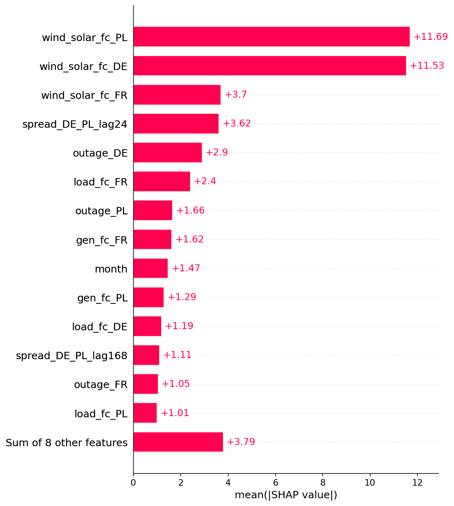

# Forecasting Inter-Zonal Electricity Price Spreads in European Markets using Machine Learning

## 1. Introduction

A *price spread* is the difference between two neighbouring countries' electricity prices in the same hour. European power markets are linked by cross-border interconnector cables. When a cable has spare capacity, trade tends to bring the two countries' prices close together; when the cable is full ("congested") the prices can split apart and a spread opens. This project forecasts two such spreads one day ahead: Germany minus France (DE-FR) and Germany minus Poland (DE-PL).

There are two natural ways to forecast a spread. One can model it directly, training a single model on the price difference. Or one can difference two forecasts, forecasting each country's price on its own and then subtracting. Both aim at the same number. The question this study answers is which of the two works better for the specific spreads examined here, and whether the answer depends on the border. The forecast is operational: it is made before the day-ahead auction clears, so it uses only information available ahead of time and predicts the spread genuinely in advance rather than describing it after the fact.

The answer differs by border. For Germany-France the two methods tie: every approach lands around €19/MWh of average error, and none is meaningfully better than another. For Germany-Poland, modelling the spread directly with gradient boosting is clearly best, at €15.39/MWh average error, a statistically significant improvement over both differencing and the linear benchmark. This study uses SHAP as an explainability method (introduced in Section 2) to show why. The German-Polish spread has sharp "switch points", for example the hours when abundant German wind-and-solar output pushes German prices below zero while Polish coal plants hold a price floor, so the spread jumps rather than sliding smoothly. A straight-line model cannot represent a jump like that, but a model built from decision trees can. Those switch points only exist on the more frequently-congested German-Polish border, which is exactly why the extra modelling effort pays off there and not on the well-connected German-French one.

The model is not just an offline experiment. It runs as a live system: an automated job fetches new market data every day, retrains, and updates a public dashboard (Section 8). The rest of the document covers the background (Section 2), the data (Section 3), the method (Section 4), the results for each model (Sections 5 and 6), the SHAP interpretation (Section 7), the live system (Section 8), and conclusions (Section 9).

## 2. Literature Review

Most electricity-price forecasting research targets a *single country's* price, not a spread. A widely-cited review (Lago et al., 2021) shapes this project in two ways. First, it sets out the evaluation standards this study follows: comparing methods over a test period of at least a year, testing whether accuracy differences are statistically significant rather than assuming them, and avoiding unreliable error measures. Second, it provides two strong reference models. One is LEAR, a linear regression that selects its own inputs using LASSO. (Such a model assumes each input moves the price by a fixed amount per unit and adds those effects up, so it can only draw straight-line relationships.) The other is a deep neural network. In their benchmark the neural network is generally the more accurate of the two, but LEAR is simple, fast and highly competitive, which makes LASSO a demanding baseline. The benchmark in this study is that same LASSO approach.

This study does not use deep learning, for reasons of scope and data rather than any claim that deep learning cannot help. Day-ahead price data is *tabular* (rows and columns, like a spreadsheet) and *medium-sized* (a few years of hourly rows, about 66,000 in this study). On tabular data of this size, tree-based models such as the one used here remain state-of-the-art and generally outperform deep neural networks, which have shown their advantage on unstructured data such as images and text rather than on tabular problems (Grinsztajn et al., 2022). A spread makes the signal thinner still, because the informative hours (the ones where the two prices diverge) are relatively rare. The goal here is a rigorously-tested, interpretable and cheaply-deployable system, so the study uses two models, LASSO regression and gradient boosting, and leaves deep learning aside.

### 2.1 Explainability (SHAP), and why it is not a novel contribution

*SHAP* (Lundberg and Lee, 2017) is a standard way to explain a model's predictions. For any single forecast it splits the prediction into a contribution from each input, showing what pushed the forecast up or down and by how much. It has been used to explain electricity prices: for example Trebbien et al. (2023) on the German market, and Pesenti and O'Sullivan (2026), who study thirty-nine European bidding zones and find that neighbouring zones account for about 61% of a price's explanation on average.

Explaining two countries' prices already contains the information needed to explain their difference, so pointing SHAP at a spread is not a new idea in itself, and this study does not claim it as one. What the existing explainability work does not do is *forecast* future prices out-of-sample; those models use same-hour information that would not be known in advance. In this study, SHAP is applied to a forecasting model only after it has been shown to work. It is used both to interpret what drives the forecasts and, in Section 7, to investigate why modelling the spread directly outperforms differencing two price forecasts, though that analysis describes the structure the model has learned rather than establishing causation in the market itself.

### 2.2 Why a spread can behave differently from a price

When the cross-border cable has spare capacity, trade tends to pull the two countries' prices together and the spread stays small; it need not be exactly zero, and it can also sit near zero simply because both prices move up or down together for shared reasons rather than because the cable is doing the work. When the cable is congested, the prices can diverge and the spread widens. So a spread is typically small and is most likely to open up during congestion. Alasseur and Féron (2018) give a formal model of this behaviour. This is the one real reason to expect direct modelling to win: forecasting each country's price separately spends most of the model's effort on the big shared drivers (fuel prices, weather, total demand) that cancel out when the two prices are subtracted, whereas a model trained on the spread itself can concentrate on the congestion behaviour. Whether that theoretical advantage actually shows up is the empirical question in this study.

The closest existing work describes prices rather than forecasts them. Saez et al. (2019) study when neighbouring prices converge but do not forecast the spread. Earlier forecasts of a spread are limited: Ferkingstad and Løland (2014) forecast a Nordic contract with classical statistics, and Imani (2024) predicts only the *direction* of Italian inter-zonal congestion (equivalently, the sign of the price difference), not the size of the spread.

### 2.3 What this study adds

The specific question left open is: for a major European spread, does modelling it directly forecast it better than differencing two separate country forecasts? Both predict the same number, so the comparison is clean. A "no" answer would be informative too, showing that the spread holds no extra structure beyond the two prices. This study also keeps the forecast operational, using only information available before the auction clears, and quantifies what that ahead-of-time constraint costs by comparing against an oracle model that is allowed to see the auction's own outputs. No prior study was found that forecasts a European spread out-of-sample, operationally, and interprets it with SHAP, but the novelty is modest and the value is in careful, honest execution rather than in a new method. (This is a "not found in a structured search" rather than a proof that none exists, since spread trading is practitioner-heavy and some work may be paywalled or not in English.)

## 3. Data

The data comes from the ENTSO-E Transparency Platform, the official public source for European electricity data, pulled through its API with the `entsoe-py` Python client. For each of the three countries, Germany-Luxembourg (DE-LU), France (FR) and Poland (PL), the pull covers the day-ahead price, actual electricity demand and the day-ahead demand forecast, actual generation by fuel type, the day-ahead wind-and-solar forecast, the day-ahead total-generation forecast, installed capacity, and power-plant outages. Cross-border data covers the physical flows on all of Germany's borders, the day-ahead scheduled trades across those borders, and France's and Poland's net positions (exports minus imports). The two forecast targets are the spreads: spread_DE_FR = price_DE − price_FR and spread_DE_PL = price_DE − price_PL.

Turning these raw feeds into one clean table meant fixing four real data problems, each of which would otherwise distort the spread. First, the German bidding zone in its current form only started in October 2018 (when the old Germany-Austria-Luxembourg zone was split), so both spreads begin in late 2018. Second, ENTSO-E reported Polish prices in złoty (the Polish currency) until 20 November 2019 and in euros afterwards; left alone this made the DE-PL spread look about four times too large in the early period, so the złoty period was converted to euros using monthly European Central Bank exchange rates. Third, from 1 October 2025 several markets switched to 15-minute pricing, so prices now arrive four times per hour while everything else is hourly; all series were averaged onto a common hourly grid. Fourth, various formatting issues (mixed daylight-saving time stamps, awkward column headers, and outages recorded as start-and-end events rather than hourly values) were cleaned up, with outages converted into an hourly "megawatts of capacity offline" figure. The result is one hourly table of about 66,000 rows and 51 columns, from December 2018 onward.

## 4. Methodology

The day-ahead market runs one auction per day that sets prices for all 24 hours of the next day. Bidding closes at noon (gate closure), and the cleared prices, together with the resulting cross-border schedules and net positions, are published shortly after (around 12:45). An operational forecast must therefore be made before noon, so the task is to predict tomorrow's 24 hourly spreads using only what is known at that point. One single model is trained for all hours rather than a separate model per hour; the hour of the day, day of the week and month are supplied as inputs (using *one-hot encoding*, which turns a category like "hour = 14" into its own yes/no column) so the one model can still learn time-of-day patterns.

A central rule is that the model may only use information that is actually known when the forecast is made, which for an operational forecast means before the auction clears. Using anything else is *leakage*: it would make the backtest look good but fail in real life. The permitted inputs are therefore the day-ahead forecasts of demand, wind-and-solar and total generation for all three countries, plant outages, and calendar and public-holiday flags, all of which are published ahead of gate closure. Two families of feed are deliberately excluded even though they describe the day-ahead timeframe: the scheduled cross-border exchanges and the countries' net positions. These are outputs of the auction itself, published together with the price at around 12:45, so a model that used them could not run before the auction it is meant to pre-empt. Realised prices, actual (after-the-fact) demand and generation, and physical flows are excluded for the same leakage reason. A second version of the model also adds the spread's own value from 24, 48 and 168 hours earlier (its "lags"); these come from prior days' already-cleared prices, so they too are known ahead of time.

The excluded auction outputs are informative, so they are not discarded entirely. A second, non-operational model that does use them is reported in Section 6 as an *oracle* benchmark: it cannot be run before the auction, because it needs data published at the same moment as the price, but it bounds what a perfect-information forecast could achieve and so measures how much accuracy the operational model gives up by staying strictly ahead of time.

The benchmark model is LASSO, a linear regression that automatically shrinks the least useful inputs to zero, so it keeps only the inputs that help; its one setting (how aggressively it shrinks) is chosen automatically on each training window. Accuracy is measured mainly by *mean absolute error* (MAE), the average size of the forecast miss in €/MWh, and also by root-mean-square error (RMSE), which is similar but penalises large misses more. These are compared against three naive yardsticks: always predict zero, always predict the historical average, and "persistence" (predict that tomorrow equals the same hour yesterday). A trading-style Sharpe ratio is deliberately not reported: as explained in Section 5, under the assumptions natural to this study it would take values so large as to be uninformative for profit-and-loss comparison.

Two ways of splitting the data into training and testing were tried. A one-off split (train up to 2023, test 2025 onward) failed badly, because the market changed character partway through (Section 5). It was replaced by walk-forward evaluation: the model is retrained every month on a rolling two-year window of the most recent data and then used to forecast the following month, walking forward through time. Development used 2021 to 2024; the final test period (2025 to mid-2026) was set aside and only scored once, at the end.

### 4.1 Gradient boosting, tuning, and significance testing

The second model is gradient boosting, implemented with XGBoost. A single decision tree splits the data with yes/no questions ("is wind-and-solar above 55 GW?") and so can represent sharp thresholds; gradient boosting builds hundreds of small trees in sequence, each correcting the last, to make an accurate overall model. Unlike LASSO regression, trees do not need their inputs rescaled or one-hot encoded, so the calendar variables are handed to XGBoost directly. Everything else is kept identical to the LASSO setup (the same walk-forward, the same inputs, the same test rows) so that any difference in results comes from the model choice alone. Within each monthly retrain, the last eight weeks of the training window are held back to decide when to stop adding trees, which prevents over-fitting.

The model's settings ("hyperparameters", such as how deep each tree can grow) were chosen in two steps. First, a manual sweep, changing one setting at a time, to build intuition and find the rough right range. Second, an automatic search with Optuna, a tool that intelligently tries many combinations and homes in on good ones, minimising the walk-forward error. This search was validated on rolling recent windows (validating on 2023 H2, 2024 H1 and 2024 H2 in turn) rather than on all history at once, so that the tuning was not dominated by the unusual 2022 energy-crisis period, which is not representative of today. The whole search was logged with MLflow for reproducibility. These hyperparameters were tuned once and reused unchanged for both the operational and the oracle model; the flat accuracy floor described in Section 6 makes that safe, since re-tuning for a smaller feature set moves the error by less than it risks over-fitting the choice to the test period.

To check whether one model is *genuinely* more accurate than another, rather than just luckier on this particular test period, results are compared with the Diebold-Mariano test. Because a once-a-day forecast produces errors that stay correlated for several days, the test uses a variance estimate (Newey-West) that accounts for that correlation, and the result is reported across a range of settings so the reader can see it does not depend on one arbitrary choice. The test is applied both to direct-versus-differenced within each model, and to XGBoost-versus-LASSO on the directly-modelled spread.

## 5. Results: LASSO Regression

The market changed character over the period. The DE-FR spread was near zero or negative from 2018 to 2023 (Germany was usually the cheaper of the two, positive in only 7 to 28% of hours), then flipped to clearly positive in 2024 to 2026 (a typical +18 to +21 €/MWh, positive about 70% of the time) as French nuclear output recovered while German prices stayed tied to expensive gas. The wind-and-solar inputs also trended upward as more capacity was built.

Because of that shift, training once on old data failed. A LASSO trained on 2018 to 2023 mis-predicted the new regime and was beaten by the naive yardsticks on the 2025+ test set: a DE-FR error of 42.8 €/MWh against a persistence yardstick of 24.4, and a DE-PL error of 23.1, worse than persistence (22.0) and worse than always predicting zero. Retraining every month on a rolling two-year window fixed this, and both models then beat every naive yardstick:

| Approach (test MAE, €/MWh) | DE-FR | DE-PL |
|---|---|---|
| persistence (t−24h) | 24.4 | 22.0 |
| static LASSO | 42.8 | 23.1 |
| walk-forward, no lags | 22.4 | 17.5 |
| walk-forward, with lags | 19.4 | 16.4 |

Retraining regularly was the decisive fix; adding the spread's own lagged values helped a bit more.

Now the central question: is modelling the spread directly better than forecasting the two prices separately and subtracting? Using the same walk-forward LASSO with lags on the identical 2025+ test rows, with only pre-auction inputs:

| Spread | Direct MAE (€/MWh) | Differenced MAE (€/MWh) |
|---|---|---|
| DE-FR | 19.4 | 19.3 |
| DE-PL | 16.4 | 17.1 |

Both gaps are around €1/MWh or less on errors of €16 to €19, so a Diebold-Mariano test was used to check whether either difference is real or just noise. The verdict differs by border:

- DE-FR: no real difference. The direct model is nominally worse by about €0.11/MWh, and no sensible setting makes that significant; for this well-connected border, forecasting the two prices separately and subtracting loses nothing.
- DE-PL: direct is genuinely better. It beats differencing by €0.71/MWh, and this holds up under every setting tested, including a conservative two-week one (p = 0.000 to 0.005).

So the advantage of direct modelling shows up on the more congested DE-PL border and not on the well-connected DE-FR one. The likely reason is that the Polish price is harder to forecast on its own, so differencing two separate forecasts stacks up two lots of error, whereas modelling the spread directly cancels the shared drivers and focuses on the congestion behaviour, exactly the mechanism from Alasseur and Féron (2018) that motivated the study.

A trading-style Sharpe ratio is deliberately omitted rather than reported. Had one been computed under the assumptions natural to this study (take a position whenever the predicted spread exceeds €5/MWh, charge a €1/MWh round-trip cost, sum the hourly profit into daily figures and annualise), the values would have run to roughly 15 to 24. Numbers of that size are not a real trading edge but an artefact of the calculation. Three things inflate them at once: the daily figures are annualised by a factor of about √365 ≈ 19; they are computed on a signed accumulation of spread levels in €/MWh rather than a risk-normalised return, so their mean-to-standard-deviation ratio is not comparable to a financial Sharpe; and the spread stayed almost entirely one-signed through the test period, which makes its direction trivially easy to call and keeps the strategy profitable on nearly every day. A Sharpe ratio above about 2 is already exceptional in real markets, so figures in the twenties are so large as to be misleading rather than informative for profit-and-loss comparison, which is why the metric is not shown and MAE is the one to trust. Whether the more flexible gradient boosting model widens the DE-PL advantage is the subject of Section 6.

## 6. Results: Gradient Boosting

Tuning gradient boosting hit an accuracy floor, not a ceiling on model capacity. In the manual sweep, making the trees deeper (from depth 2 to depth 8) left the validation error stuck at about €18/MWh even as the training error fell from 24 to 11. That widening gap between training and validation error is the classic sign of a model memorising noise in the training data without getting better at forecasting. The automatic Optuna search confirmed it: across sixty attempts, the validation error never left a narrow band of about €17.0 to €18.0. The best setting found was a *deep, heavily-restrained* tree, yet it reached the very same floor as a *shallow, unrestrained* one. Two opposite configurations landing on the same error, with all sixty attempts within about €1 of each other, means there is a genuine floor to how well this data can be forecast, and no amount of tuning breaks through it. This confirms the point from Section 2 that, for data of this size and shape, added model complexity buys little accuracy.

Run once on the untouched 2025+ test set, the tuned XGBoost against the LASSO benchmark, for both spreads and both methods, using only pre-auction information:

| Spread | Model / method | MAE | RMSE |
|---|---|---|---|
| DE-FR | LASSO direct | 19.42 | 26.83 |
| | LASSO differenced | 19.30 | 27.16 |
| | XGBoost direct | 19.28 | 27.20 |
| | XGBoost differenced | 19.98 | 27.92 |
| DE-PL | LASSO direct | 16.39 | 25.82 |
| | LASSO differenced | 17.10 | 26.03 |
| | **XGBoost direct** | **15.39** | **26.76** |
| | XGBoost differenced | 16.26 | 25.72 |

Two significance tests make the comparison precise. Direct versus differenced within XGBoost: on DE-PL, direct beats differencing by €0.87/MWh, significant under every setting up to a conservative two-week window (p = 0.000 to 0.020); on DE-FR direct also "wins" nominally, but only at short bandwidths, losing significance once the test allows for a week or more of error correlation, and the win comes from differencing two wobbly gradient-boosting forecasts stacking up their errors (XGBoost-differenced is the worst DE-FR row) rather than from any real spread structure. XGBoost versus LASSO on the direct spread: on DE-FR the two are tied (no setting is significant), but on DE-PL gradient boosting beats LASSO regression by €1.00/MWh, significant under every setting (p = 0.000 to 0.004).

The gains from modelling the spread directly *and* from using gradient boosting appear only on the congested DE-PL border and are absent on the well-connected DE-FR one. The DE-PL spread holds real, usable structure that a model both trained on the spread directly and flexible enough to capture thresholds can exploit, and it exists exactly where the congestion mechanism says it should. The best operational DE-PL model is therefore the direct, tuned XGBoost at 15.39 €/MWh, a statistically significant improvement over both the differenced forecast and LASSO regression.

How much does staying strictly ahead of the auction cost? The excluded auction outputs, the scheduled cross-border exchanges and the net positions, can be added back to build an oracle model. It is not deployable, because it needs data published at the same moment as the price, but it bounds what a perfect-information forecast could achieve. With those inputs restored, the direct DE-PL XGBoost reaches 14.40 €/MWh, about €1/MWh better than the operational 15.39. So operating in real time, before the auction, costs roughly one euro per megawatt-hour of accuracy. The oracle also widens the direct model's edge over differencing, from €0.87 to €2.23, which Section 7 traces to the specific cross-border thresholds those inputs expose.

To put these errors in scale: over the test period the DE-PL spread has a standard deviation of 32.5 €/MWh and lies within ±1 of zero about 22% of the time, so it swings widely and often changes sign. Against that, the 15.39 €/MWh operational MAE is about 47% of one standard deviation, and the model explains roughly 32% of the spread's variance; the MAE is 30% lower than the persistence baseline and 18% lower than always predicting zero. The RMSE of 26.76 exceeds the MAE mainly because of fat tails: a minority of volatile congested hours carry large errors and inflate it, so the typical hour's miss is smaller than the MAE alone suggests. Percentage errors such as MAPE are not reported, because the spread crosses zero and dividing by near-zero values makes them unstable and misleading (Lago et al., 2021).

This operational model has been shown to forecast, so it is the one interpreted with SHAP in Section 7.

## 7. Interpretation: What the DE-PL Model Learned

SHAP was applied to the winning operational model, the direct, tuned XGBoost for DE-PL trained on pre-auction inputs. A single explanatory model was trained on the two most recent years (2023 to 2024) and its predictions on 2025+ were broken down with SHAP; this explanatory model matches the live model's accuracy (14.7 €/MWh versus 15.4), so its explanations are representative.

With the auction-outcome inputs removed, the forecast is driven almost entirely by the renewable forecasts. Polish wind-and-solar (worth on average 11.7 €/MWh of movement in the forecast) and German wind-and-solar (11.5) tower over everything else. A long way behind come French wind-and-solar (3.7), the spread's own value from yesterday (3.6), German and Polish plant outages (2.9 and 1.7), French demand (2.4), the generation forecasts, and the month of the year (1.5). The calendar inputs otherwise barely matter, which fits a spread driven by physical fundamentals rather than the clock. The directions make economic sense: lots of Polish wind and sun makes Polish power cheap and widens the (Germany minus Poland) spread, while lots of German wind and sun makes German power cheap and narrows it. These signs agree with LASSO regression's coefficients, so the two models tell the same economic story. The renewables dominate more here than in the oracle model (Section 7.2), because the operational model has to read the congestion signal off the fundamentals that drive it rather than off the scheduled flows themselves.

*Figure 1. How much each input moves the forecast on average (mean absolute SHAP, €/MWh). The two renewable forecasts dominate; the auction-outcome inputs are absent by design.*

*Figure 2. Each dot is one hour. Left-right shows how much that input pushed the forecast that hour; colour shows whether the input was high (red) or low (blue). High Polish renewables push the spread up; high German renewables push it down.*

The spread's own recent values sit mid-table (the 24-hour lag at 3.6, the week-old lag near the bottom at 1.1), lower than their usefulness for accuracy would suggest. Two things explain the gap. First, the SHAP ranking measures *amplitude*: how many €/MWh an input typically moves the forecast. A lag acts as a small, usually-correct persistence nudge that trims many hours by a little without ever swinging the forecast far, so it lowers the average error while barely registering on an amplitude scale, whereas a renewable driver occasionally moves the forecast by tens of €/MWh and so dominates the ranking. Second, the spread is only weakly autocorrelated: its correlation with its own value a day earlier is only about 0.3, and weaker still a week back, so each lag genuinely carries limited information, most of it in the 24-hour lag. The lags are therefore worth keeping but form a diffuse, low-amplitude signal, which is exactly the profile that looks minor in a SHAP bar chart while still helping accuracy. Measuring that accuracy contribution needs an ablation rather than SHAP, the test described in Section 7.2.

This also explains why gradient boosting beats LASSO regression. The renewables act on the spread through sharp thresholds rather than smooth slopes, and LASSO regression, which can only fit straight lines, cannot bend at a threshold. The clearest is German wind-and-solar: as its forecast climbs past about 55 GW, German prices fall through zero and the spread drops away steeply rather than sliding (Section 7.1). Polish renewables behave similarly at the point where a renewable surplus tips Poland from importing to exporting and its price collapses. These are switches, not gradients, and they are the congestion behaviour Alasseur and Féron (2018) describe: the spread acts one way when the cable has room and another way when it is full. This is the mechanical reason for the Section 6 result, present on the congested DE-PL border and absent on the well-connected DE-FR one.

### 7.1 Two thresholds, checked against the raw data

Two of these patterns are worth checking directly against the raw data, not just trusting the model. In both cases the data confirms the pattern is a real economic effect, and both show why a spread has to be understood as one joint object, not two separate prices.

German wind-and-solar: a negative-price cliff near 55 GW. The model shows the effect declining smoothly, then dropping steeply around 55 GW of forecast wind-and-solar. Grouping German prices by that forecast shows why:

| German wind+solar forecast | mean price_DE | share of hours price_DE < 0 | mean spread |
|---|---|---|---|
| 20–35 GW | 79 | 2% | −20 |
| 45–50 GW | 30 | 23% | −36 |
| 50–55 GW | 14 | 34% | −48 |
| **55–60 GW** | **−7** | **59%** | **−60** |
| 60 GW+ | −28 | 89% | −65 |

Below the threshold, each extra gigawatt of renewables pushes out a fossil plant and trims a still-positive price. Around 55 GW the fossil plants are all gone, and any more supply pushes the German price *below zero* (a real feature of power markets, where some plants must keep running and are paid to keep producing). Negative-price hours jump from about a third to a majority. Poland, mostly coal and with a price floor, does not follow, so the spread blows out downward. This is a threshold a straight line cannot draw, and it is the operational model's single largest driver.

*Figure 3. German wind-and-solar forecast: a smooth decline that steepens into a cliff near 55 GW, where German prices turn negative.*

Polish renewable surplus: the spread is widest when Poland has little to export, then jumps as Poland becomes an exporter. The operational model reads this through the Polish wind-and-solar forecast rather than through the net position directly, since the net position is an auction output it may not use, but the underlying effect is the same and can be checked against the raw data. Grouping the actual DE-PL spread by Poland's net position over 2023 to 2024 confirms it:

| Polish net position (MW) | mean actual spread (€/MWh) |
|---|---|
| heavy import (−6000…−2000) | −19.5 |
| moderate import (−1000…−500) | −22.8 |
| balanced (−1…+1) | **−25.5** |
| light export (+1…+500) | −9.8 |
| heavy export (+2000…+6000) | +10.7 |

The spread is most negative when trade is balanced and gets *less* negative as Poland imports more heavily, which is the opposite of the naive guess that an importing, and therefore expensive, Poland should show the smallest gap. The reason is that the spread is a difference. Heavy Polish importing happens in the cold, still, high-demand hours when renewables are low everywhere, so Germany is also running expensive plants; both prices are high and close together, and the gap shrinks. In normal balanced conditions Germany runs its cheap renewables while Poland runs coal, so the gap is at its widest. The step comes when a Polish renewable surplus tips the country into exporting and its own price collapses, which the operational model captures from the Polish renewable forecast that drives the surplus, and which gradient boosting can bend at the threshold while a straight line cannot.

*Figure 4. Polish wind-and-solar forecast: the spread rises as Polish renewables climb, with the effect steepening as a surplus turns Poland into an exporter and collapses its price.*

In both cases the usable structure is a threshold rather than a smooth slope, which gradient boosting can fit and LASSO regression cannot; this is what SHAP shows directly, and it explains why XGBoost beats LASSO on this border. Both thresholds are also joint, spanning the two zones at once (German supply against a Polish price floor, and Polish supply against German prices), which is why a model trained on the spread can represent them, and part of why direct modelling beats differencing even without the auction-outcome inputs.

### 7.2 Why direct modelling wins, and what the auction outputs add

Section 6 showed the direct spread model beating differencing on DE-PL by €0.87/MWh operationally, and by €2.23 for the oracle that also sees the auction outputs. SHAP explains both, because the differenced forecast is price_DE_forecast minus price_PL_forecast and SHAP contributions add up: differencing's implied attribution of any input to the spread is, hour by hour, the German price model's SHAP value minus the Polish one's. So for each input one can compare how the direct model attributes it to the spread against how differencing implicitly does.

The operational model's two dominant drivers are single-zone. Polish and German wind-and-solar each cheapen their own country's power, so the separate price models learn them independently and differencing reproduces them almost exactly, with the direct and differenced attribution curves matching in shape almost perfectly. The direct model gains nothing on the renewables themselves. Its €0.87 operational edge is therefore mostly the more mundane benefit noted in Section 5, that differencing two independently-noisy price forecasts adds their errors while modelling the spread directly does not, plus a little of the joint threshold structure the direct model reconstructs from the cross-zonal fundamentals.

The oracle model shows where the rest of a direct model's advantage comes from when the auction outputs are available. With Poland's net position and the scheduled Germany-to-Poland flow restored, the direct model's edge over differencing more than doubles, to €2.23. These two inputs are joint, spanning both zones at once, and the direct model exploits them at sharp thresholds that subtracting two independently-fit price models cannot rebuild. The direct attribution of the Polish net position steps up by 8.5 €/MWh as Poland flips from importer to exporter, while differencing moves only 2.6 and tracks the direct shape poorly (Figure 5); for the scheduled flow the direct model captures a 6.3 €/MWh drop at the roughly 500 MW congestion point, against 0.5 for differencing, about a seventh of the effect (Figure 6).

An ablation confirms these inputs cause the gap rather than merely being attributed to it. An ablation deletes an input, retrains the model from scratch so it reorganises around whatever remains, and measures the change in out-of-sample error; if the error rises, the input was carrying accuracy that no other input could replace. Removing the two cross-border inputs from the oracle's single explanatory model cuts its direct-versus-differenced advantage from 3.3 to 1.8 €/MWh, so they account for about 45% of it. The remainder is the error-compounding penalty, which applies whatever the inputs and is the part the operational model keeps. In short, the direct model's edge is joint cross-border structure plus error-compounding avoidance; take away the auction outputs and the first half goes with them, leaving the operational model's smaller but still-significant advantage.

*Figure 5. Oracle model. How the Polish net position is attributed to the DE-PL spread. The direct model (pink) steps up sharply as Poland turns exporter; the differenced approach (blue), the German price model's SHAP minus the Polish one's, barely moves.*

*Figure 6. Oracle model. The scheduled Germany-to-Poland flow. The direct model captures the congestion drop near 500 MW; differencing captures a fraction of it.*

Two caveats apply. SHAP describes what the model *learned*, not proven cause and effect, and these explanations come from representative explanatory models rather than any single day's live forecast. Within those limits, the operational model earns its accuracy from sensible, ahead-of-time physical drivers, and the reasons it beats both LASSO regression and the differenced forecast are visible and make economic sense.

## 8. Deployment: A Live Forecasting System

The model runs as a service that updates itself, so the public dashboard shows current forecasts rather than a frozen snapshot. The live pipeline uses the same feature-building, the same leakage rules and the same tuned operational model as the research code; the only difference is that it works on the most recent days rather than rebuilding all of history each time.

Each daily run checks the latest date already stored, re-fetches a short recent window from ENTSO-E (the last ten days, so that ENTSO-E's frequent late corrections to demand, generation and outage figures get picked up rather than frozen at their first value), rebuilds those hours into the same table format as the research, and writes them into a cloud database. That write is done carefully: a freshly fetched value replaces the old one, but if a value is missing from a given run (ENTSO-E's API returns occasional errors, especially on the outage feed) the existing stored value is kept rather than overwritten with a blank. The run then retrains the operational model on the last two years and writes out the coming day's forecast. Because the operational model uses only inputs published before gate closure, the run happens in the late morning, ahead of the auction, and produces a genuine forward forecast of the next day's 24 spreads before the market sets them. Each forecast is stored with no realised value yet; the actual spread is filled in on a later run, once the auction has cleared, so the dashboard shows a true ahead-of-time forecast next to the outcome that arrives afterwards.

Scheduling is handled by an automated workflow that runs the pipeline each day ahead of the auction, with the ENTSO-E key and database password stored as encrypted secrets rather than written into the code. The dashboard is a lightweight web app that reads the forecasts and data straight from the database each time it loads, and also lets visitors download the data. The whole system runs on free service tiers at no ongoing cost, which is deliberate: it is built to run unattended for months without a bill, and the ten-day re-fetch means a temporary data glitch fixes itself on the next day's run.

## 9. Conclusion

The study set out to answer one question: for the day-ahead spreads on these two German borders, is a spread forecast better by modelling it directly or by differencing two separate country forecasts? The answer depends on the border. On the well-connected Germany-France border the two methods are tied and nothing beats simple LASSO regression; differencing two clean price forecasts loses nothing. On the congested Germany-Poland border, modelling the spread directly with tuned gradient boosting is clearly and reliably best, at 15.39 €/MWh average error, beating both the differenced forecast and LASSO regression with high statistical confidence. The forecast is operational: it uses only information available before the auction clears, so it predicts the spread genuinely ahead of time. Allowing the model to also see the auction's own outputs, an oracle it could not run in real time, improves accuracy by only about €1/MWh, which bounds the cost of forecasting ahead of the market.

The gains from direct modelling and from using gradient boosting appear *together* and *only* on Germany-Poland, and SHAP traces them to renewable-driven switch points: German wind-and-solar pushing prices below zero, and a Polish renewable surplus flipping the country from importer to exporter. These are thresholds that LASSO regression cannot draw, and they occur exactly where congestion economics say they should. When the auction's own cross-border outputs are made available to the oracle, the same joint structure appears more sharply, which is where its extra euro of accuracy comes from. Tuning, separately, found a firm accuracy floor: making the model more complex did not lower the error, consistent with the Section 2 point that data of this size and shape does not call for heavier models.

The study is deliberately narrow. It covers two spreads on two German borders over one test period, so the exact numbers should not be over-generalised; no trading-style Sharpe ratio is reported, because under these assumptions it would be inflated to the point of being uninformative (Section 5); SHAP shows what the model learned, not causation; and the model gives single-number forecasts without a confidence range. Natural next steps would be more borders, forecasts that come with a calibrated uncertainty range, and testing under realistic trading costs. Within its scope, the project is a careful, honestly-tested, and now continuously-running operational forecasting system whose one real edge is visible, explainable, and consistent with how the market works.

---

## References

Alasseur, C., & Féron, O. (2018). Structural price model for coupled electricity markets. *Energy Economics*, 75, 104–119.

Diebold, F. X., & Mariano, R. S. (1995). Comparing predictive accuracy. *Journal of Business & Economic Statistics*, 13(3), 253–263.

ENTSO-E. Transparency Platform Restful API. European Network of Transmission System Operators for Electricity. https://transparency.entsoe.eu

EnergieID. *entsoe-py: Python client for the ENTSO-E API.* https://github.com/EnergieID/entsoe-py

Ferkingstad, E., & Løland, A. (2014). Coping with area price risk in electricity markets: Forecasting Contracts for Difference in the Nordic power market. *arXiv:1406.6862*.

Grinsztajn, L., Oyallon, E., & Varoquaux, G. (2022). Why do tree-based models still outperform deep learning on typical tabular data? *Advances in Neural Information Processing Systems (NeurIPS)*, 35.

Imani, M. H. (2024). Empirical analysis of inter-zonal congestion in the Italian electricity market using multinomial logistic regression. *Energies*, 17(23), 5901.

Lago, J., Marcjasz, G., De Schutter, B., & Weron, R. (2021). Forecasting day-ahead electricity prices: A review of state-of-the-art algorithms, best practices and an open-access benchmark. *Applied Energy*, 293, 116983.

Lundberg, S. M., & Lee, S.-I. (2017). A unified approach to interpreting model predictions. *Advances in Neural Information Processing Systems (NeurIPS)*, 30.

Newey, W. K., & West, K. D. (1987). A simple, positive semi-definite, heteroskedasticity and autocorrelation consistent covariance matrix. *Econometrica*, 55(3), 703–708.

Newey, W. K., & West, K. D. (1994). Automatic lag selection in covariance matrix estimation. *Review of Economic Studies*, 61(4), 631–653.

Pesenti, A., & O'Sullivan, A. (2026). Analysing drivers and interdependencies in European electricity markets using XAI. *arXiv:2606.19118*.

Saez, Y., Mochon, A., Corona, L., & Isasi, P. (2019). Integration in the European electricity market: A machine learning-based convergence analysis for the Central Western Europe region. *Energy Policy*, 132, 549–566.

Trebbien, J., Rydin Gorjão, L., Praktiknjo, A., Schäfer, B., & Witthaut, D. (2023). Understanding electricity prices beyond the merit order principle using explainable AI. *Energy and AI*, 13 / *arXiv:2212.04805*.
