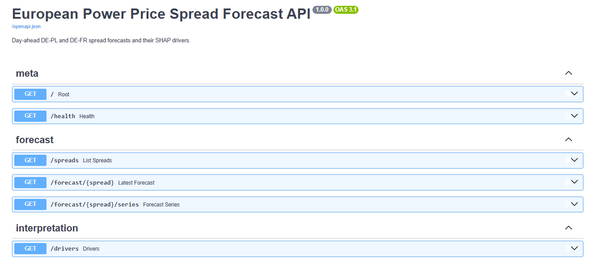
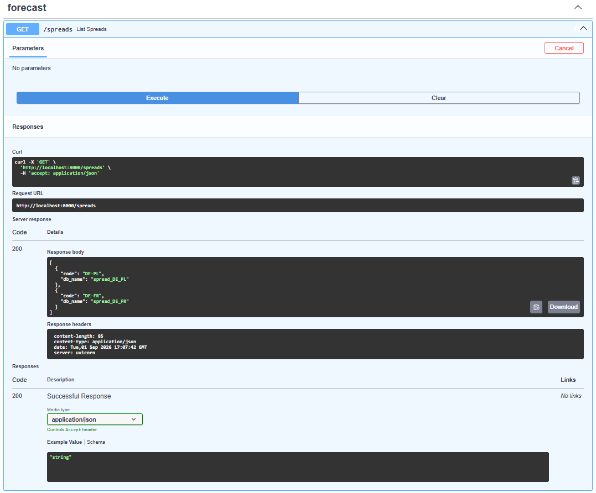

# ⚡ Forecasting Selected European Power Price Spreads

A leakage-safe, walk-forward study of the German–French (DE–FR) and German–Polish (DE–PL)
day-ahead electricity price spreads, deployed as a live, self-updating dashboard. It asks a
specific question: **is an inter-zonal price spread forecast better by modelling it directly,
or by differencing two independent zonal forecasts?** It answers this out-of-sample, with
significance testing and SHAP interpretation.

**Headline result.** The forecast is *operational*: it uses only information available before
the day-ahead auction clears. For the congestion-prone DE–PL border, a tuned gradient-boosting
model applied to the spread *directly* is the best forecast at **15.39 €/MWh MAE**, significantly
beating both the LASSO benchmark (by €1.00/MWh) and the differenced-forecast approach (by
€0.87/MWh), with significance holding across error-correlation windows from one day to two weeks.
A *quasi-perfect-foresight* benchmark that also sees the auction's own outputs (scheduled
exchanges and net positions) reaches 14.40 €/MWh — so forecasting before the auction costs only
about €1/MWh. For the well-coupled DE–FR border, no approach significantly beats any other,
exactly where the coupling/decoupling mechanism predicts spread-specific structure should be absent.

**Live dashboard:** <https://power-spread-forecasting.streamlit.app/>

## The app

The Streamlit dashboard (`app.py`) shows:

- **actual vs predicted** spread for both borders over the test period, plus the forecast for the next day;
- the **SHAP drivers**: a ranked table of what moves the forecast, with plain-English descriptions, and the importance bar chart;
- **downloads** for the underlying data (CSV) and the project paper (PDF).

## Live system

The dashboard is not a static snapshot; it updates itself daily:

- `daily_update.py` refetches the latest ENTSO-E data, retrains the model, and writes fresh forecasts to a cloud Postgres SQL database.
- The **GitHub Actions** workflow (`.github/workflows/daily-update.yml`) is triggered each morning by an external **cron-job.org** schedule, which calls the GitHub `workflow_dispatch` API before the day-ahead gate closure. (GitHub's own scheduled trigger fired unreliably, so it is not used.) It runs 7 days a week, using repository secrets for the ENTSO-E token and database URL.
- The Streamlit app reads the predictions and data live from the database on each load.
- Everything runs on free service tiers, at zero standing cost.

## Run it locally

```bash
python -m pip install -r requirements.txt
python -m streamlit run app.py
```

## Reproduce the analysis

All modelling lives in one script with stage subcommands. Pass `--pre-auction` to reproduce the
operational (headline) model; omit it for the quasi-perfect-foresight benchmark.

```bash
python spread_forecasting.py lasso                   # LASSO walk-forward benchmark
python spread_forecasting.py xgb-manual              # single-split XGBoost fit (intuition)
python spread_forecasting.py optuna                  # Optuna tuning (rolling-window CV)  [--mlflow]
python spread_forecasting.py compare --pre-auction   # final LASSO vs XGBoost  -> predictions_preauction.csv
python spread_forecasting.py dm --pre-auction        # Diebold–Mariano significance tests
python spread_forecasting.py shap --pre-auction      # SHAP interpretation -> shap_*_preauction.png
```

The deployment scripts (`load_to_postgres.py` for the one-time load, `daily_update.py` for the
daily refresh) use `requirements-daily.txt`.

## Method

- **Data**: ENTSO-E Transparency Platform (day-ahead prices, load / wind-solar / generation
  forecasts, scheduled exchanges, net positions, outages) for DE-LU, FR, PL: hourly, from
  January 2019 and updated daily, with the PLN→EUR currency break and the Oct-2025 15-minute
  settlement switch corrected.
- **Features**: leakage-safe only: information known at day-ahead gate closure, plus 24/48/168h
  target lags. No realised prices or actuals. Auction outputs (scheduled exchanges, net positions)
  are excluded from the operational model and enter only the quasi-perfect-foresight benchmark.
- **Models**: LASSO (LEAR-style) benchmark vs XGBoost tuned with Optuna over a rolling-window
  cross-validation, tracked in MLflow.
- **Evaluation**: rolling two-year window, retrained monthly, tested out-of-sample; MAE / RMSE
  with Diebold–Mariano tests under a Newey–West HAC variance.

## API

A FastAPI service serves the forecasts and SHAP drivers over HTTP
(`uvicorn api.main:app`). Interactive docs at `/docs`:



Example live response from `/spreads`:

